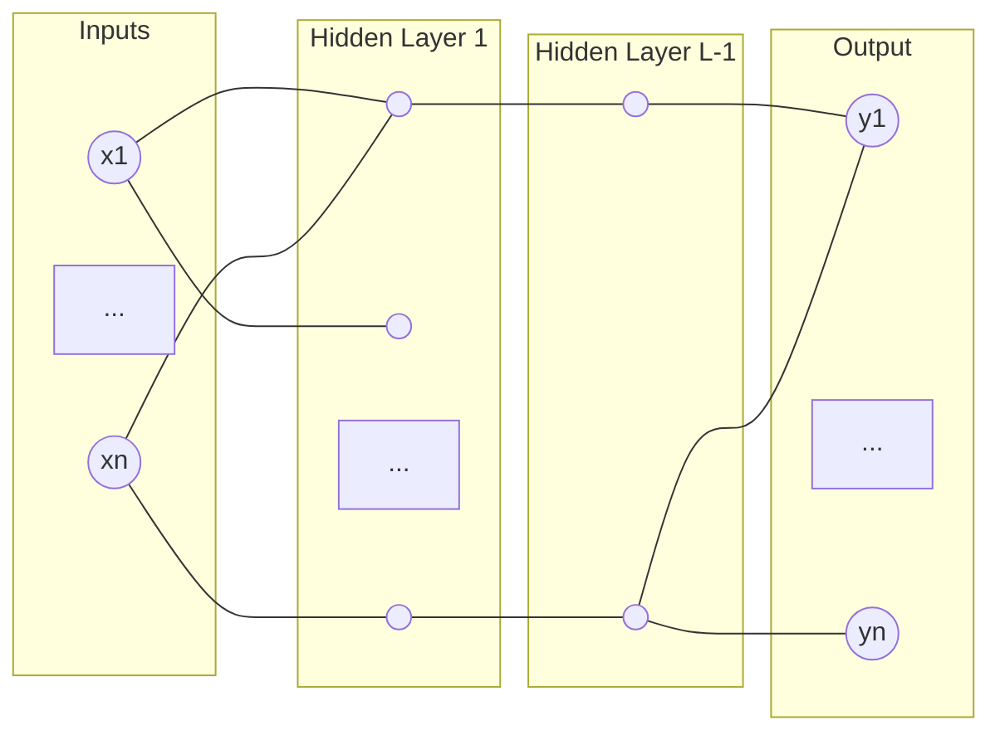

# Neural Networks and the Bayesian Posterior

**Aim:** Using a concrete example of Neural Networks (NNs), introduce the posterior and the free energy, thus explaining the intuition of:

$$F_n \approx n \min_{\omega \in W} L_n(\omega) + \lambda \log n$$

> **Key Insight:** In singular models, non-true parameters can nonetheless be preferred by the posterior.

---

## Feedforward ReLU Neural Networks

**Definition:** A feedforward ReLU Neural Net function is a function:
$$f : \mathbb{R}^N \times W \longrightarrow \mathbb{R}^H$$
- $N$: number of inputs (in statistical models)
- $W$: parameter space
- $H$: number of outputs

### Architecture Diagram


This induces a function where both $x$ and $w$ are vectors:
$$f(x, w) = (A^L \circ \text{ReLU} \circ A^{L-1} \circ \text{ReLU} \dots \circ A^1)(x)$$

Each $A^L$ is parameterized by weights $W^L$ and biases $b^L$:
$$A^L(z) = (w^L)^T z + b^L$$

*Note: You do not evaluate with ReLU on the last layer in regression.*

---

## Regression with Neural Networks

We define the triplet $(\text{model, truth, prior}) = (P(y|x,w), q(y|x), \varphi(w))$.

### 1. Truth
We suppose i.i.d. data $d_n = \{ (X_1, Y_1), \dots, (X_n, Y_n) \}$ which is drawn from an unknown true distribution $q(y|x)$.

### 2. Model
Given a FFNN function $f(x,w)$, the regression model is given by:
$$p(y|x,w) = f(x,w) + \varepsilon, \quad \varepsilon \sim N(0,1) \text{ (noise)}$$
$$p(y|x,w) = \exp \left( -\frac{1}{2} \| y - f(x,w) \|^2_W \right)$$

It is the property of $f(x,w)$ that determines whether the model is **regular** or **strictly singular**.
- **Linear Regression:** Regular model.
- **FFNN:** Strictly singular.

---

## The Prior and Singularity

### 3. Prior
$\varphi(w)$ is a "subjective" distribution of parameters $w$ based on the experimenter's prior beliefs.
- **Example:** $\varphi(w) = N(0,1)$

In Bayesian statistics, we do not want to learn the true weights, but the **true distribution** of the weights. Generally, as the number of training samples $n \to \infty$, we do not care about the prior (subject to some restrictions).

**Theorem:** FFNN under the regression models are **strictly singular**; that is, the Fisher Information Matrix $I(w)_{j,u}$ is degenerate:
$$I(w)_{j,u} = \int_{\mathbb{R}^N} \left\langle \frac{\partial f(x,w)}{\partial w_j}, \frac{\partial f(x,w)}{\partial w_u} \right\rangle q(x) dx$$

---

## Bayesian Posterior and Free Energy

The Bayesian posterior is given by:
$$p(w|D_n) = \frac{p(D_n|w)\varphi(w)}{P(D_n)}$$

Where $p(D_n|w) = \prod_{i=1}^n P(y_i|x_i, w)$. Since $P(D_n)$ does not depend on $w$, it serves as a normalizing constant:
$$P(D_n) = \int_W p(D_n|w)\varphi(w) dw$$

### Definitions
The posterior can be expressed via the average log-loss $L_n(w)$:
$$P(w|D_n) = \frac{1}{Z_n} \varphi(w) e^{-n L_n(w)}$$
$$L_n(w) = -\log P(D_n|w) = \frac{1}{n} \sum_{i=1}^n \frac{1}{2} \| y_i - f(x_i, w) \|^2 + \text{const. (MSE)}$$

$Z_n = \int_W e^{-n L_n(w)} \varphi(w) dw$ is the **partition function** (from statistical physics).

**Free Energy:** The free energy of a compact $W \subseteq W$ is:
$$F_n(W) = -\log Z_n(W) = -\log \left( \int_W e^{-n L_n(w)} \varphi(w) dw \right)$$

---

## Neural Networks Posterior using MCMC

We use MCMC or HMC algorithms for sampling from the posterior $P(w|D_n)$. We expect samples to concentrate in regions of:
- **High posterior density** $\implies$ Low free energy $\implies$ Low generalization error $\implies$ "Good models" (low error, low complexity).

### Example Model: Two-layer FFNN
2 nodes, 2 inputs, 1 output:
$$f(x,w) = q_1 \cdot \text{ReLU}(\langle w_1, x \rangle + b_1) + q_2 \cdot \text{ReLU}(\langle w_2, x \rangle + b_2) + c$$
$w_i \in \mathbb{R}^2, q_i, b_i, c \in \mathbb{R}$.

**Truth:** If the truth is realizable (e.g., deforming from 2 nodes $\to$ 1 node), then the set of true parameters $w_0 = \{ w \mid P(y|x,w) = q(y|x) \}$ is non-empty.

### Reading the Plots & Singularity
1. **Scaling Symmetry:** $w_i$ normalized $\to \hat{w}_i = |q_i| w_i$.
2. **Permutation Symmetry:** $\hat{w}_1$ and $\hat{w}_2$ are superimposed.

These symmetries are essentially what give Neural Networks their **singularity**.

---

## The Free Energy Formula

Neural networks need not always prefer weights that minimize the loss; rather, they prefer those minimizing **free energy**.

**Free Energy Formula:**
$$F_n = \underbrace{n L_n(w_0)}_{\text{Energy}} + \underbrace{\lambda \log n}_{\text{Entropy}}$$

- $w_0 = \{ w \in W \mid p(x|w) = q(x) \}$ which is equivalent to $K(q(x) \| p(x|w)) = 0$.
- Average log loss: $L(w) = S + K(q \| p)$, where $S$ is Entropy.

### Loss Landscape Visualization
For realizable models, $w_0 = w_{opt}$.


```mermaid
graph TD
    subgraph Loss_Landscape [Loss Landscape L(w)]
    A[Local Minimum u_0] --- B[Global Minimum w_0]
    B --- S_Line[Entropy Level S]
    end
```
*(In this visualization, $w_0$ represents the true parameters where $L=S$. A model might get "stuck" at the local minimum $u_0$, but $w_0$ is preferred by the free energy for realizable models.)*

<script type="module">
  import mermaid from 'https://cdn.jsdelivr.net/npm/mermaid@10/dist/mermaid.esm.min.mjs';
  mermaid.initialize({ startOnLoad: true });
</script>

<script src="https://polyfill.io/v3/polyfill.min.js?features=es6"></script>
<script id="MathJax-script" async src="https://cdn.jsdelivr.net/npm/mathjax@3/es5/tex-mml-chtml.js"></script>
